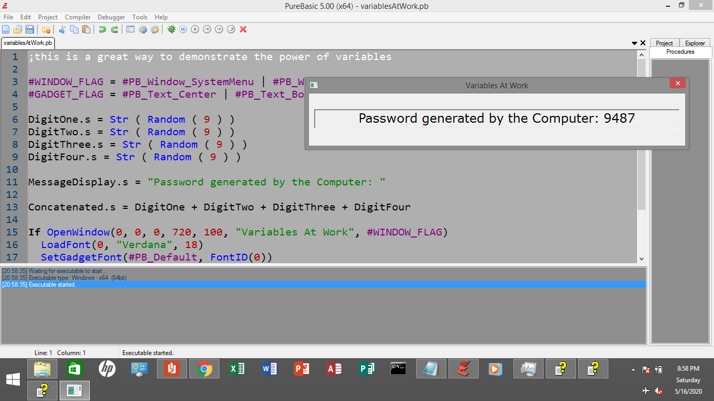

# PureBasic Password Generator

This is a very simple program for beginners who want to grasp
the concept of a variable in programming. This can be developed
also as a complete program for creating passwords automatically.

Just see the code and enjoy the simplicity!

## Compiling
Just click `Compile/Run` button in your PureBasic IDE
or press F5.

## Contributing
1. Fork the repo!
2. Then, made changes and create a pull request. 
3. If not fork, just please star this. Thanks! 

## License
MIT - the permissive license
